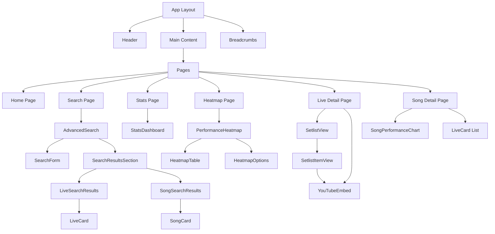

# Application Structure Documentation

## Component Hierarchy



## Key Components and Responsibilities

### Pages

| Page | Path | Purpose | Key Components |
|------|------|---------|----------------|
| Home | `/` | Landing page with navigation | Links to main sections |
| Search | `/search` | Live and song search interface | AdvancedSearch |
| Stats | `/stats` | Performance statistics dashboard | StatsDashboard |
| Heatmap | `/heatmap` | Performance frequency visualization | PerformanceHeatmap |
| Live Detail | `/lives/[liveId]` | Live performance details | SetlistView, YouTubeEmbed |
| Song Detail | `/songs/[songId]` | Song details and performances | SongPerformanceChart |

### Core Components

#### Header Component
- Manages site navigation
- Contains mode switches for timeline/list views
- Provides settings for breadcrumbs display

#### Breadcrumbs Component
- Displays navigation path
- Supports both history and location modes
- Stores navigation state in localStorage

#### AdvancedSearch Component
- Provides filtering and search for lives and songs
- Handles form inputs and search logic
- Displays search results using LiveCard and SongCard

#### PerformanceHeatmap Component
- Visualizes song performance frequency over time
- Supports different time units (year, quarter)
- Allows filtering and sorting of data

#### SetlistView Component
- Displays the setlist for a specific live
- Renders each song with album information
- Integrates YouTube video embeds

#### YouTubeEmbed Component
- Embeds YouTube videos with custom UI
- Handles different YouTube URL formats
- Supports timestamp extraction

#### StatsDashboard Component
- Displays statistics about performances
- Uses Recharts for data visualization
- Provides filtering by date range

## Client vs. Server Components

The application follows Next.js App Router architecture with a mix of server and client components:

### Server Components
- Page components (`page.tsx`)
- Data loading logic (`static-data-loader.ts`)
- Metadata generation

### Client Components
- Interactive UI components (marked with 'use client')
- Components that use browser APIs (localStorage, window)
- Chart components using Recharts

## Static Site Generation

All pages are statically generated at build time:

- Each page exports a `generateStaticParams()` function
- Data is loaded from YAML files at build time
- The application is exported as static HTML/CSS/JS
- Hosted on AWS Amplify

## State Management

- Local component state using React hooks
- Cross-component state via React Context
- Persistent state in localStorage
- No external state management libraries

## Key Files and Directories

```
src/
├── app/                  # Next.js App Router pages
│   ├── page.tsx          # Home page
│   ├── search/           # Search page
│   ├── stats/            # Stats page
│   ├── heatmap/          # Heatmap page
│   ├── lives/[liveId]/   # Live detail page
│   └── songs/[songId]/   # Song detail page
├── components/           # React components
│   ├── AdvancedSearch/   # Search components
│   ├── Breadcrumbs/      # Navigation breadcrumbs
│   ├── Header/           # Site header
│   ├── LiveCard/         # Live performance card
│   ├── PerformanceHeatmap/ # Heatmap visualization
│   ├── SetlistView/      # Setlist display
│   ├── SongCard/         # Song information card
│   ├── StatsDashboard/   # Statistics dashboard
│   └── YouTubeEmbed/     # YouTube video embed
├── types/                # TypeScript type definitions
│   ├── album.ts
│   ├── albumTrack.ts
│   ├── live.ts
│   ├── setlist.ts
│   └── song.ts
└── utils/                # Utility functions
    ├── data-converter.ts # Data conversion utilities
    ├── song-enricher.ts  # Song data enrichment
    └── static-data-loader.ts # Data loading functions
```