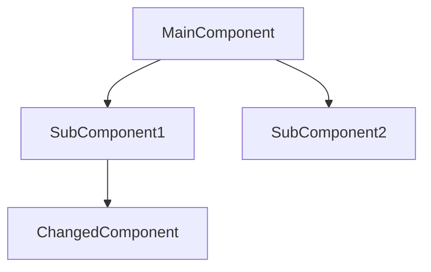
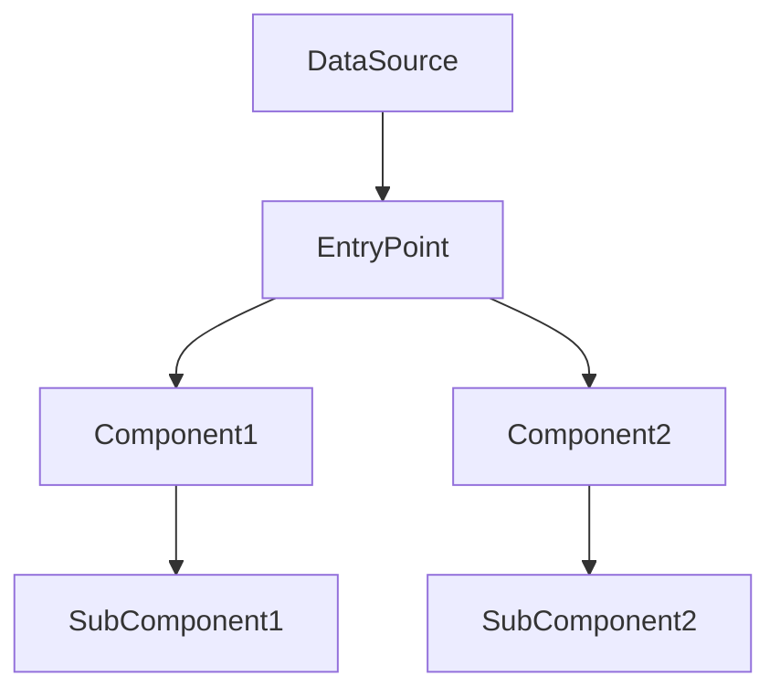
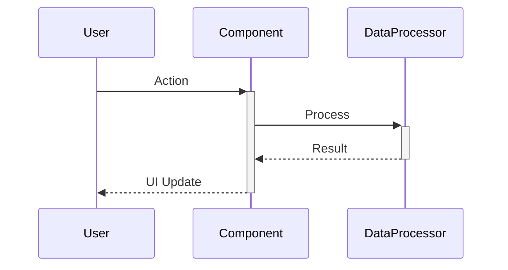
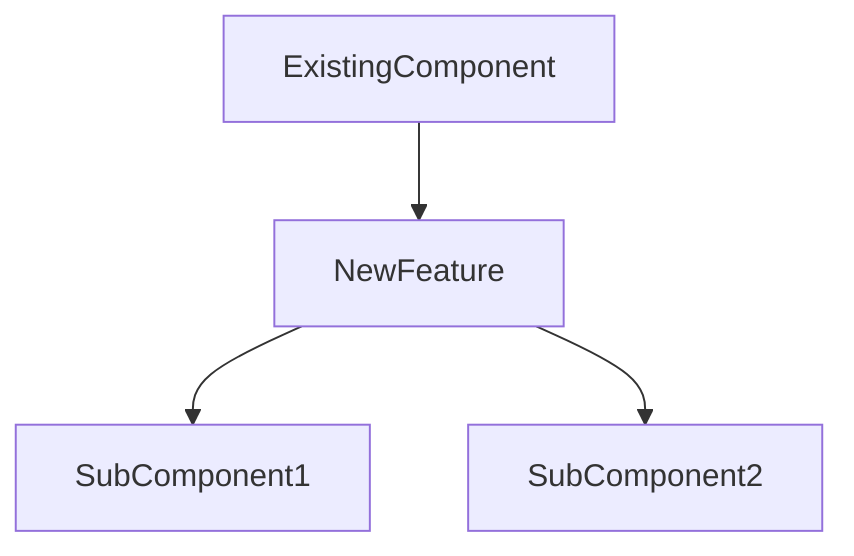

# Component Modification Templates

These templates provide standardized formats for requesting changes to the application. Each template corresponds to a different modification scope.

## Small Modification Template

Use this template for small changes affecting a single component or file.

```markdown
#NRTP-S 修正: [簡潔な修正名]

## 修正内容
- [必要な変更の簡潔な説明]

## 修正対象
- ファイル: `src/components/ComponentName/ComponentName.tsx`
- 影響範囲: 低（単一コンポーネント内）

## 実装詳細
```tsx
// 修正前のコード
const Component = () => {
  return <div>元の実装</div>;
};

// 修正後のコード
const Component = () => {
  return <div>修正された実装</div>;
};
```

## テスト方法
1. [テスト手順1]
2. [テスト手順2]
```

## Medium Modification Template

Use this template for changes affecting multiple related components.

```markdown
#NRTP-M 機能追加/修正: [機能名]

## 機能概要
- [追加/修正する機能の説明]

## 修正対象
- 主要ファイル: `src/components/MainComponent/MainComponent.tsx`
- 関連ファイル:
  - `src/components/SubComponent/SubComponent.tsx`
  - `src/types/type.ts`
- 影響範囲: 中（関連する複数コンポーネント）

## データモデル変更
```typescript
// 新規または変更するタイプ定義
type NewType = {
  property1: string;
  property2: number;
};
```

## コンポーネント間の関係


## 実装詳細
### MainComponent の変更
```tsx
// 変更箇所の実装例
```

### SubComponent の変更
```tsx
// 変更箇所の実装例
```

## テスト方法
1. [テスト手順1]
2. [テスト手順2]
```

## Large Modification Template

Use this template for significant changes affecting multiple parts of the application.

```markdown
#NRTP-L 機能拡張: [機能名]

## 機能概要
- [追加/変更する機能の詳細な説明]
- [主要なユースケース]
- [期待される結果]

## 全体的なアーキテクチャ


## データフロー


## 修正対象
- 主要コンポーネント: 
  - `src/components/ComponentA/ComponentA.tsx`
  - `src/components/ComponentB/ComponentB.tsx`
- ユーティリティ: 
  - `src/utils/utilityA.ts`
- タイプ定義: 
  - `src/types/typeA.ts`
- 影響範囲: 高（複数の機能領域に影響）

## データモデル変更
```typescript
// 新規または変更するタイプ定義
```

## 実装ステップ
1. [ステップ1の詳細]
   ```tsx
   // 実装例
   ```
2. [ステップ2の詳細]
   ```tsx
   // 実装例
   ```
3. [ステップ3の詳細]
   ```tsx
   // 実装例
   ```

## テスト計画
1. [テストケース1]
   - 前提条件: [条件]
   - 操作: [操作]
   - 期待結果: [結果]
2. [テストケース2]
   - 前提条件: [条件]
   - 操作: [操作]
   - 期待結果: [結果]
```

## Feature Addition Template

Use this template when adding a completely new feature.

```markdown
#NRTP-M 新機能: [機能名]

## 機能概要
- [新機能の説明]
- [解決する問題やユースケース]

## 新規コンポーネント
- `src/components/NewFeature/NewFeature.tsx` - メインコンポーネント
- `src/components/NewFeature/SubComponent.tsx` - サブコンポーネント
- `src/types/newTypes.ts` - 新規タイプ定義

## コンポーネント構造


## データモデル
```typescript
export type NewFeatureType = {
  id: string;
  name: string;
  properties: {
    prop1: string;
    prop2: number;
  }[];
};
```

## UI デザイン
- 配置: [配置場所の説明]
- スタイル: [スタイルの説明または参照]
- レスポンシブ対応: [レスポンシブデザインの考慮事項]

## 実装詳細
### NewFeature コンポーネント
```tsx
import React from 'react';
import { SubComponent } from './SubComponent';

interface NewFeatureProps {
  data: NewFeatureType;
}

export const NewFeature: React.FC<NewFeatureProps> = ({ data }) => {
  // 実装例
};
```

### 既存コンポーネントとの統合
```tsx
// 既存コンポーネントへの統合方法
```

## テスト方法
1. [テストシナリオ1]
2. [テストシナリオ2]
```

## Bug Fix Template

Use this template for bug fixes.

```markdown
#NRTP-S バグ修正: [バグの簡潔な説明]

## バグ概要
- [バグの詳細な説明]
- [再現手順]
- [影響範囲]

## 原因
- [バグの技術的原因]

## 修正対象
- ファイル: `src/components/BuggyComponent/BuggyComponent.tsx`

## 修正内容
```tsx
// 修正前（バグを含むコード）
const BuggyComponent = () => {
  const [state, setState] = useState(buggyValue);
  // 問題のあるコード
};

// 修正後
const BuggyComponent = () => {
  const [state, setState] = useState(fixedValue);
  // 修正されたコード
};
```

## テスト方法
1. [バグ再現手順]
2. [修正確認手順]
```

## Component Refactoring Template

Use this template for refactoring exercises.

```markdown
#NRTP-M リファクタリング: [コンポーネント名]

## リファクタリング目的
- [リファクタリングの理由]
- [期待される改善点]

## 修正対象
- ファイル: `src/components/ComponentToRefactor/ComponentToRefactor.tsx`
- 現在の問題点: 
  - [問題点1]
  - [問題点2]

## リファクタリング方針
1. [方針1]
2. [方針2]

## 実装詳細
### コンポーネント分割
```tsx
// 元のコンポーネント
const LargeComponent = () => {
  // 多くのロジックと複雑なレンダリング
};

// リファクタリング後
const RefactoredComponent = () => {
  // 主要な制御ロジック
  return (
    <>
      <SubComponentA />
      <SubComponentB />
    </>
  );
};

const SubComponentA = () => {
  // 分離されたロジックA
};

const SubComponentB = () => {
  // 分離されたロジックB
};
```

### パフォーマンス最適化
```tsx
// Before
// 最適化前のコード

// After
// useMemo、useCallbackなどを使用した最適化後のコード
```

## テスト方法
1. [テスト手順1]
2. [テスト手順2]
```

## Style Modification Template

Use this template for UI/UX changes.

```markdown
#NRTP-S スタイル修正: [修正内容]

## 修正箇所
- コンポーネント: `src/components/ComponentName/ComponentName.tsx`
- 対象要素: [修正する要素の説明]

## 修正内容
- [スタイルの変更内容の説明]

## 実装詳細
```tsx
// 修正前
<div className="bg-gray-100 p-4 rounded">
  <h2 className="text-lg">タイトル</h2>
</div>

// 修正後
<div className="bg-purple-100 p-6 rounded-lg shadow-sm">
  <h2 className="text-xl font-bold text-purple-800">タイトル</h2>
</div>
```

## スタイル変数変更
```css
/* Tailwind extend設定の修正が必要な場合 */
```

## 確認項目
- レスポンシブ対応: [モバイル/タブレット/デスクトップでの表示確認]
- アクセシビリティ: [コントラスト比などの確認]
```

## Configuration Change Template

Use this template for configuration changes.

```markdown
#NRTP-S 設定変更: [変更内容]

## 変更対象
- ファイル: `next.config.mjs`, `tailwind.config.ts` など
- 目的: [変更の目的]

## 変更内容
```js
// 修正前
const config = {
  setting: 'oldValue',
};

// 修正後
const config = {
  setting: 'newValue',
  newSetting: true,
};
```

## 影響範囲
- [変更による影響の説明]

## 検証方法
1. [検証手順1]
2. [検証手順2]
```

## Quick Fix Template

Use this template for urgent, minimal changes.

```markdown
#NRTP-S クイック修正: [修正内容]

## 修正対象
- ファイル: `src/path/to/file.tsx`
- 行: [行番号]

## 変更内容
```diff
- const buggyValue = wrongCalculation();
+ const fixedValue = correctCalculation();
```

## 修正理由
- [簡潔な理由の説明]
```
