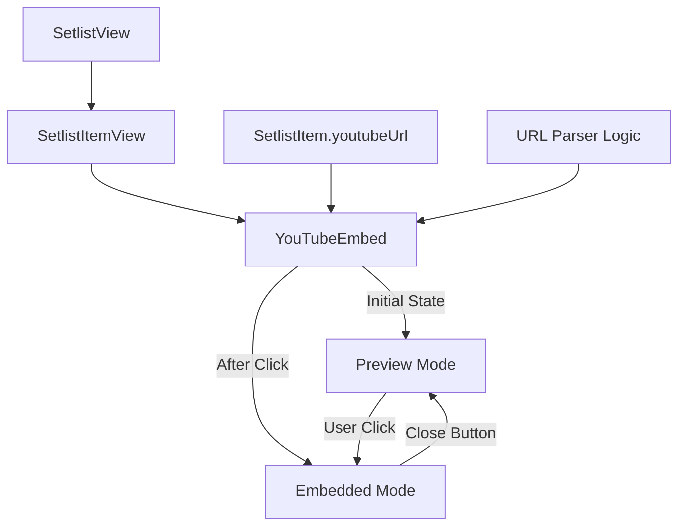
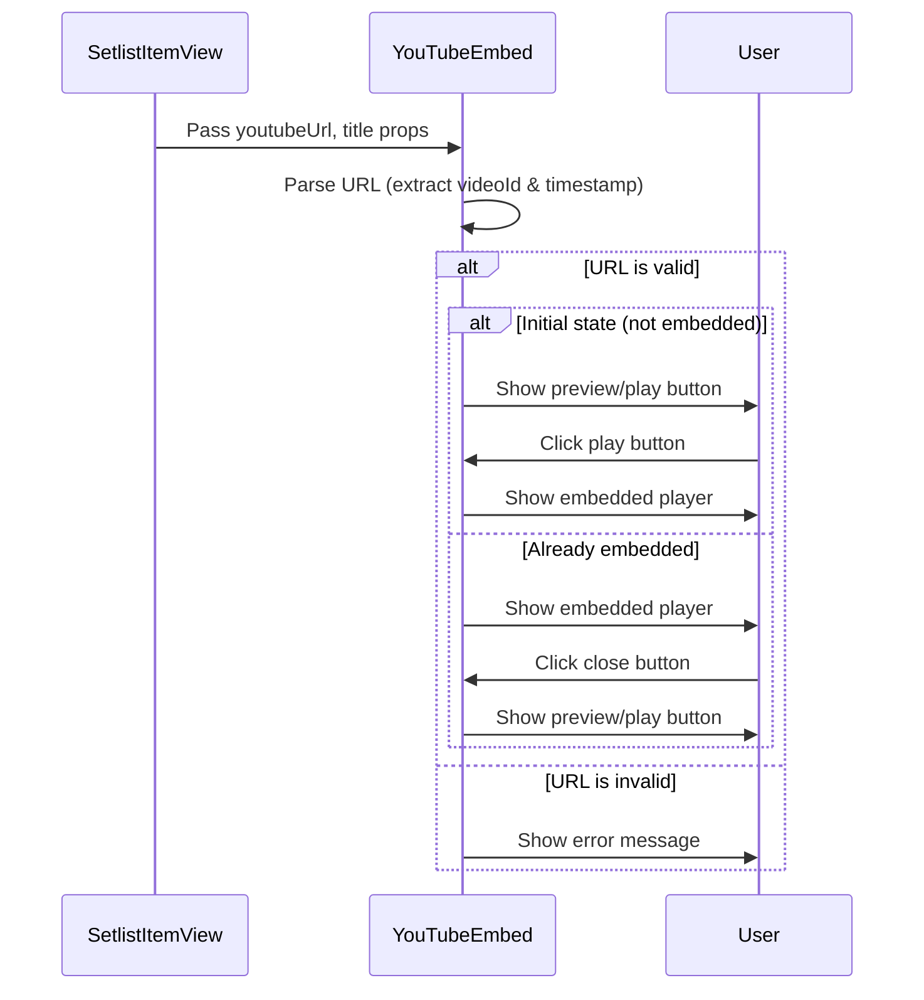

# YouTube Embed Component Documentation

## Component Architecture



## Component Flow



## Implementation Details

### Component Props

```typescript
interface YouTubeEmbedProps {
  url: string;        // YouTube URL (required)
  title?: string;     // Video title (defaults to "動画を再生")
  autoEmbed?: boolean; // Auto-embed video (defaults to false)
}
```

### URL Parsing Logic

The component supports various YouTube URL formats:

1. `https://www.youtube.com/watch?v=VIDEO_ID`
2. `https://youtu.be/VIDEO_ID`
3. URLs with timestamps: `?t=123` or `&t=123` or `?start=123`

```typescript
// YouTubeのURLからvideo IDとタイムスタンプを抽出
const extractVideoInfo = (url: string) => {
  try {
    const videoUrl = new URL(url);
    
    // youtu.be形式のURLからIDを抽出
    if (videoUrl.hostname === 'youtu.be') {
      const videoId = videoUrl.pathname.substring(1);
      const startTime = videoUrl.searchParams.get('t') || 
                        videoUrl.searchParams.get('start') || '0';
      return { videoId, startTime };
    }
    
    // youtube.com形式のURLからIDを抽出
    if (videoUrl.hostname.includes('youtube.com')) {
      const videoId = videoUrl.searchParams.get('v');
      
      // 時間パラメータの抽出（t=123形式またはstart=123形式）
      let startTime = videoUrl.searchParams.get('t') || 
                      videoUrl.searchParams.get('start') || '0';
                      
      // ?si=xxxx&t=123 形式への対応
      if (url.includes('&t=')) {
        const tMatch = url.match(/&t=(\d+)/);
        if (tMatch && tMatch[1]) {
          startTime = tMatch[1];
        }
      }
      
      return { videoId, startTime };
    }
    
    // 対応していないURL形式
    return { videoId: null, startTime: '0' };
  } catch (error) {
    console.error('Invalid YouTube URL:', error);
    return { videoId: null, startTime: '0' };
  }
};
```

### State Management

The component uses React's useState hook to manage the embedded state:

```typescript
const [isEmbedded, setIsEmbedded] = useState(autoEmbed);
```

### Rendering Logic

The component conditionally renders different UI based on the embedded state:

```tsx
// Preview mode
return (
  <div className="mt-2">
    <button
      onClick={() => setIsEmbedded(true)}
      className="flex items-center gap-2 text-sm text-red-600 hover:text-red-700 bg-red-50 hover:bg-red-100 px-3 py-1.5 rounded-lg transition-colors"
      aria-label={`${title}を埋め込みモードで再生`}
    >
      <PlayCircle size={16} />
      <Youtube size={16} />
      <span>{title}</span>
    </button>
  </div>
);

// Embedded mode
return (
  <div className="mt-3 mb-5">
    <div className="relative pb-[56.25%] h-0 overflow-hidden rounded-lg bg-gray-100">
      <iframe
        className="absolute top-0 left-0 w-full h-full"
        src={embedUrl}
        title={title}
        frameBorder="0"
        allow="accelerometer; autoplay; clipboard-write; encrypted-media; gyroscope; picture-in-picture"
        allowFullScreen
      ></iframe>
    </div>
    <div className="flex justify-between items-center mt-2 text-xs text-gray-500">
      <button
        onClick={() => setIsEmbedded(false)}
        className="text-gray-600 hover:text-gray-800"
        aria-label="埋め込み動画を閉じる"
      >
        埋め込み動画を閉じる
      </button>
      <a
        href={url}
        target="_blank"
        rel="noopener noreferrer"
        className="flex items-center gap-1 text-blue-600 hover:text-blue-800"
        aria-label="YouTubeで視聴"
      >
        <ExternalLink size={14} />
        YouTubeで視聴
      </a>
    </div>
  </div>
);
```

## Integration with Setlist View

The YouTubeEmbed component is integrated into the SetlistItemView component:

```tsx
{/* YouTube埋め込み */}
{youtubeUrl && (
  <YouTubeEmbed 
    url={youtubeUrl} 
    title={`${songTitle}の演奏動画`} 
  />
)}
```

## Usage Examples

### Basic Usage

```tsx
<YouTubeEmbed
  url="https://www.youtube.com/watch?v=dQw4w9WgXcQ"
  title="サンプル動画"
/>
```

### With Timestamp

```tsx
<YouTubeEmbed
  url="https://www.youtube.com/watch?v=dQw4w9WgXcQ&t=30"
  title="30秒からの動画"
/>
```

### Auto-embedded

```tsx
<YouTubeEmbed
  url="https://www.youtube.com/watch?v=dQw4w9WgXcQ"
  title="自動再生の動画"
  autoEmbed={true}
/>
```

## Error Handling

The component handles invalid URLs by displaying an error message:

```tsx
if (!videoId) {
  return (
    <div className="text-red-500 text-sm">
      無効なYouTube URL: {url}
    </div>
  );
}
```

## Performance Considerations

1. The iframe is only loaded when the user clicks the play button, reducing initial page load time
2. The component uses small icon sizes to minimize layout shifts
3. The preview button has a small footprint in the UI

## Accessibility Features

1. Proper aria-labels for buttons
2. External link indicator for "YouTubeで視聴"
3. Color contrast for text and buttons
4. Keyboard navigable controls