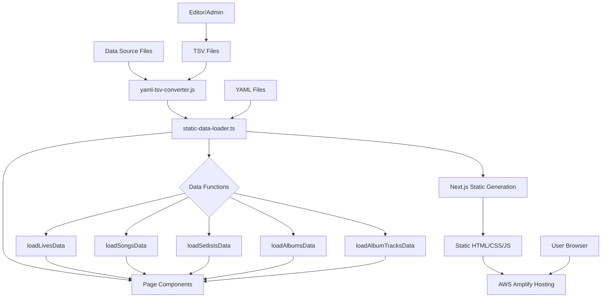
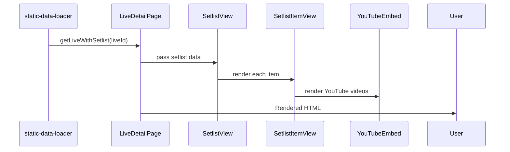
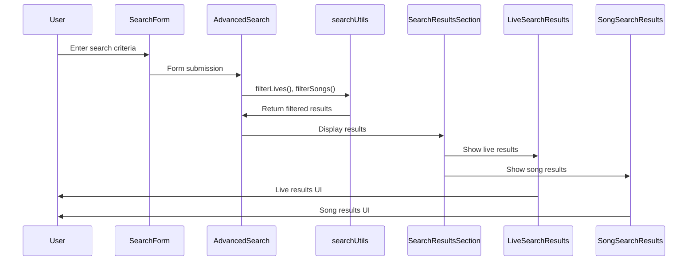

# Data Flow Documentation

## Data Processing Pipeline



## Build-time Data Processing

### 1. Data Source Preparation

The application uses YAML files as the primary data source. For editing purposes, these can be converted to/from TSV format:

```
┌─────────────┐     ┌───────────────────┐     ┌─────────────┐
│ YAML Files  │ --> │ yaml-tsv-converter│ --> │ TSV Files   │
└─────────────┘     └───────────────────┘     └─────────────┘
      ^                                              |
      |                                              |
      └──────────────────────────────────────────────┘
                         Edit & Convert
```

### 2. Static Data Loading

During the build process, data is loaded from YAML files and processed:

```
┌─────────────┐     ┌───────────────────┐     ┌─────────────┐
│ YAML Files  │ --> │static-data-loader │ --> │ Typed Data  │
└─────────────┘     └───────────────────┘     └─────────────┘
                            │
                            v
                    ┌───────────────────┐
                    │ Data Functions    │
                    └───────────────────┘
```

### 3. Page Data Loading

Each page uses appropriate data loading functions to retrieve the data needed:

```
┌───────────────┐     ┌───────────────────┐     ┌─────────────┐
│ Page Component│ --> │ Data Function     │ --> │ Page Props  │
└───────────────┘     └───────────────────┘     └─────────────┘
                              │
                              v
                      ┌───────────────────┐
                      │Static Generation  │
                      └───────────────────┘
```

## Key Data Functions

| Function | Purpose | Source File |
|----------|---------|-------------|
| `loadLivesData()` | Loads live performance data | static-data-loader.ts |
| `loadSongsData()` | Loads song data | static-data-loader.ts |
| `loadSetlistsData()` | Loads setlist data | static-data-loader.ts |
| `loadAlbumsData()` | Loads album data | static-data-loader.ts |
| `loadAlbumTracksData()` | Loads album track data | static-data-loader.ts |
| `parseLiveHistory()` | Parses live history from text | data-converter.ts |
| `parseSetlistHistory()` | Parses setlist history from text | data-converter.ts |
| `enrichSongData()` | Enriches song data with additional info | song-enricher.ts |

## Data Caching Strategy

The static-data-loader implements a simple in-memory cache:

```typescript
// Data cache (loaded only once during build)
let cachedLives: Live[] | null = null;
let cachedSongs: Song[] | null = null;
let cachedSetlists: SetlistItem[] | null = null;
let cachedAlbums: Album[] | null = null;
let cachedAlbumTracks: AlbumTrack[] | null = null;
```

Data is loaded from YAML files only once during the build process, then cached for subsequent requests.

## Client-side Data Processing

For interactive components, data is passed as props from server components to client components:

```
┌───────────────┐     ┌───────────────────┐
│Server Component│ --> │ Client Component  │
└───────────────┘     └───────────────────┘
        │                      │
        v                      v
┌───────────────┐     ┌───────────────────┐
│   Data Props   │ --> │  React State      │
└───────────────┘     └───────────────────┘
                              │
                              v
                      ┌───────────────────┐
                      │   User Interface   │
                      └───────────────────┘
```

## Data Flow Examples

### Example 1: Live Detail Page



### Example 2: Search Functionality



## Data Migration Workflow

For updating the application data:

1. Edit TSV files in a spreadsheet application
2. Convert TSV to YAML using the converter script
3. Build the application to generate static pages
4. Deploy the generated static files to AWS Amplify

```
┌─────────────┐     ┌───────────────┐     ┌─────────────┐
│ Edit TSV    │ --> │ Convert to YAML│ --> │ Build App   │
└─────────────┘     └───────────────┘     └─────────────┘
                                                │
                                                v
                                          ┌─────────────┐
                                          │ Deploy      │
                                          └─────────────┘
```