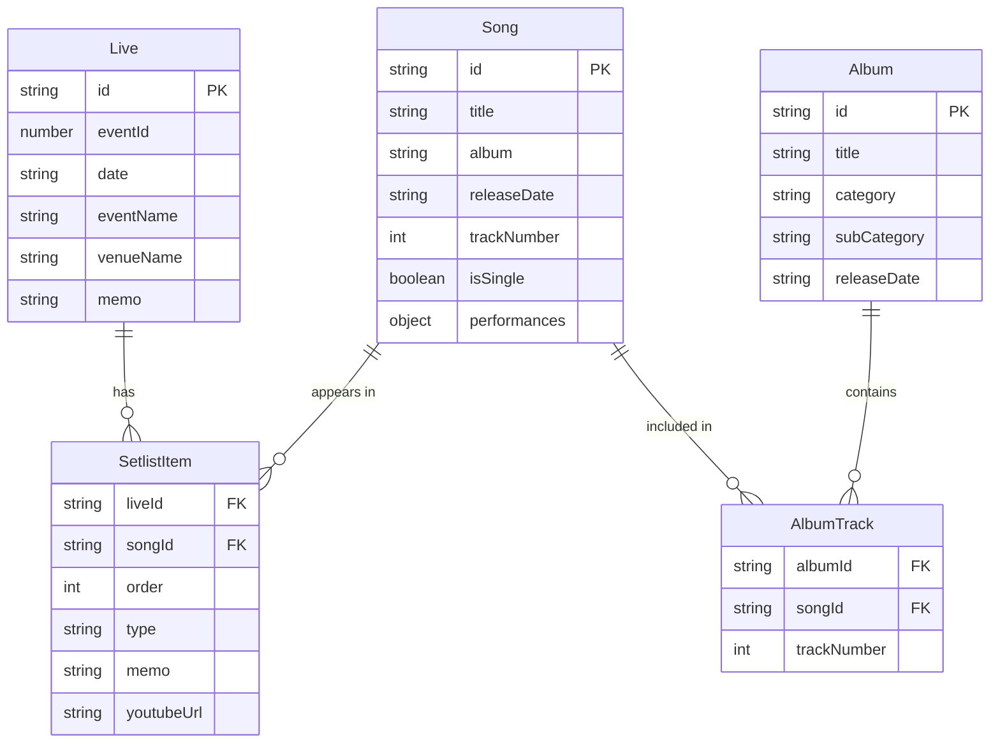

# Data Model Documentation

## Entity Relationship Diagram



## Data Type Definitions

### Live

```typescript
export type Live = {
  id: string;          // Live ID (e.g., live001)
  eventId: number;     // Original event ID
  date: string;        // Date (YYYY-MM-DD format)
  eventName: string;   // Event name
  venueName: string;   // Venue name
  memo?: string;       // Notes (optional)
  // API extension data (response only)
  setlist?: Array<{    // Setlist information (simplified)
    songId: string;
    title: string;
    order: number;
    memo?: string;
    youtubeUrl?: string; // YouTube URL (optional)
  }>;
  songCount?: number;  // Number of songs performed
};
```

### Song

```typescript
export type Song = {
  id: string;          // Song ID (e.g., song001)
  title: string;       // Song title
  album: string;       // Main album name
  releaseDate: string; // Release date
  trackNumber: number; // Track number
  isSingle: boolean;   // Whether it's a single
  
  // API extension properties
  performances?: {
    count: number;     // Total performance count
    firstPerformance?: {
      liveId: string;
      date: string;
      liveName: string;
    };
    lastPerformance?: {
      liveId: string;
      date: string;
      liveName: string;
    };
  };
};
```

### SetlistItem

```typescript
export type SetlistItem = {
  liveId: string;      // Live ID
  songId: string;      // Song ID
  order: number;       // Performance order
  type: string;        // Type ('individual'/'medley')
  memo: string;        // Notes
  youtubeUrl?: string; // YouTube URL (optional)
  
  // Display extension information (API response)
  songTitle?: string;  // Song title
  albumName?: string;  // Album name
};
```

### Album

```typescript
export type Album = {
  id: string;          // Album ID (e.g., album001)
  title: string;       // Album title
  category: string;    // Category (Album/Single)
  subCategory: string; // Sub-category (Major/Indie/Best)
  releaseDate: string; // Release date
};
```

### AlbumTrack

```typescript
export type AlbumTrack = {
  albumId: string;     // Album ID
  songId: string;      // Song ID
  trackNumber: number; // Track number
};
```

## Data Relationships

- **Live to SetlistItem**: One-to-many relationship. A live performance contains multiple setlist items.
- **Song to SetlistItem**: One-to-many relationship. A song can appear in multiple setlist items.
- **Album to AlbumTrack**: One-to-many relationship. An album contains multiple tracks.
- **Song to AlbumTrack**: One-to-many relationship. A song can appear on multiple albums.

## Data Sources

The application uses YAML files as the primary data source:

- `data_yaml/lives.yml` - Live performance data
- `data_yaml/songs.yml` - Song data
- `data_yaml/setlists.yml` - Setlist data
- `data_yaml/albums.yml` - Album data
- `data_yaml/album_tracks.yml` - Album track data

These files are converted to/from TSV format for editing via the `yaml-tsv-converter.js` script.

## Data Flow

1. YAML files are loaded at build time by `static-data-loader.ts`
2. Data is processed and transformed into the appropriate types
3. Pages use the data loader functions to retrieve data
4. All data operations are performed at build time for static site generation