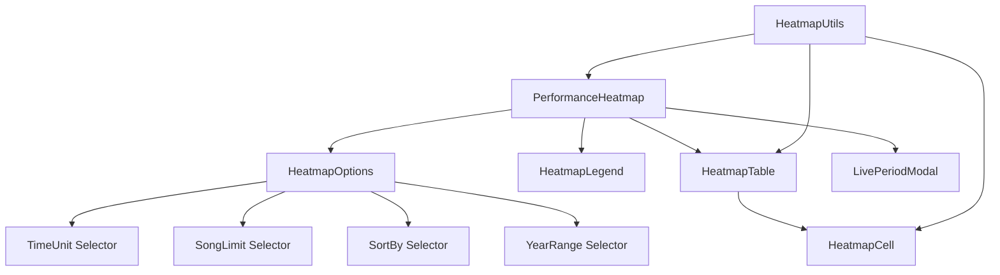
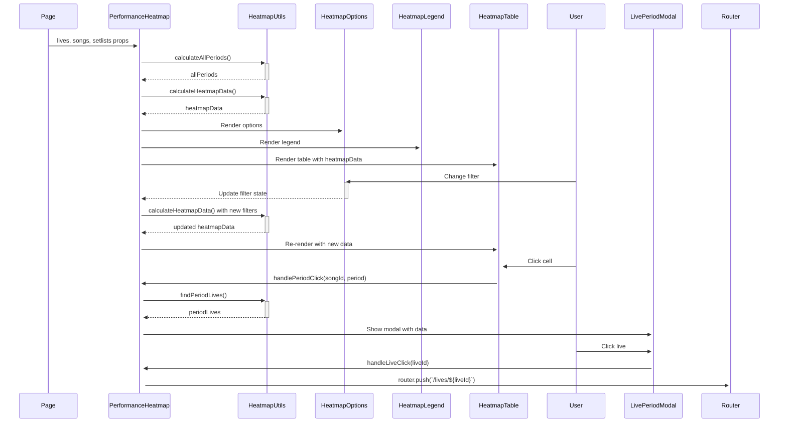

# Performance Heatmap Component Documentation

## Component Architecture



## Data Flow



## Component Props

### PerformanceHeatmap

```typescript
interface PerformanceHeatmapProps {
  lives: Live[];
  songs: Song[];
  setlists: SetlistItem[];
}
```

### HeatmapTable

```typescript
interface HeatmapTableProps {
  heatmapData: SongHeatmapData[];
  isCompactMode: boolean;
  setIsCompactMode: (isCompact: boolean) => void;
  onCellClick: (songId: string, period: string) => void;
  containerHeight: string;
}
```

### HeatmapCell

```typescript
interface HeatmapCellProps {
  periodData: PeriodData;
  songTitle: string;
  onClick: () => void;
}
```

## Key Data Structures

### Period Data

```typescript
type PeriodData = {
  period: string;
  count: number;
  intensity: number;
  isBeforeRelease: boolean;
};
```

### Song Heatmap Data

```typescript
type SongHeatmapData = {
  song: Song;
  periods: PeriodData[];
  totalCount: number;
  releaseYear: number | null;
};
```

### Selected Period

```typescript
type SelectedPeriod = {
  song: Song;
  period: string;
  lives: Live[];
} | null;
```

## State Management

The PerformanceHeatmap component manages several state variables:

```typescript
// Filter states
const [timeUnit, setTimeUnit] = useState<TimeUnit>('year');
const [sortBy, setSortBy] = useState<SortOption>('lastPlayed');
const [songLimit, setSongLimit] = useState(200);
const [yearRange, setYearRange] = useState<{ start: number; end: number }>({
  start: 2003, 
  end: new Date().getFullYear(),
});

// UI states
const [selectedPeriod, setSelectedPeriod] = useState<SelectedPeriod>(null);
const [isOptionsCollapsed, setIsOptionsCollapsed] = useState(true);
const [isCompactMode, setIsCompactMode] = useState(false);
```

## Core Functions

### Period Calculation

```typescript
// Calculate all time periods from live performance dates
export const calculateAllPeriods = (
  lives: Live[], 
  timeUnit: TimeUnit
): string[] => {
  const periods = new Set<string>();
  
  lives.forEach(live => {
    const date = new Date(live.date);
    const year = date.getFullYear();
    
    if (timeUnit === 'year') {
      periods.add(year.toString());
    } else {
      const quarter = Math.floor(date.getMonth() / 3) + 1;
      periods.add(`${year}-Q${quarter}`);
    }
  });
  
  // Sort in descending order (newest first)
  return Array.from(periods).sort((a, b) => b.localeCompare(a));
};
```

### Heatmap Data Calculation

```typescript
export const calculateHeatmapData = (
  songs: Song[],
  lives: Live[],
  setlists: SetlistItem[],
  timeUnit: TimeUnit,
  sortBy: SortOption,
  songLimit: number,
  yearRange: { start: number; end: number },
  allPeriods: string[]
): SongHeatmapData[] => {
  // Filter lives by year range
  const filteredLives = lives.filter(/* filter logic */);
  
  // Get filtered live IDs
  const filteredLiveIds = filteredLives.map(live => live.id);
  
  // Initialize song period counts
  const songPeriodCounts: Record<string, Record<string, number>> = {};
  
  // Initialize with all songs and periods
  songs.forEach(song => {
    songPeriodCounts[song.id] = {};
    allPeriods.forEach(period => {
      songPeriodCounts[song.id][period] = 0;
    });
  });
  
  // Count performances by period
  setlists
    .filter(item => filteredLiveIds.includes(item.liveId))
    .forEach(item => {
      const live = lives.find(l => l.id === item.liveId);
      if (!live) return;
      
      // Determine period based on time unit
      const date = new Date(live.date);
      const year = date.getFullYear();
      let period: string;
      
      if (timeUnit === 'year') {
        period = year.toString();
      } else {
        const quarter = Math.floor(date.getMonth() / 3) + 1;
        period = `${year}-Q${quarter}`;
      }
      
      // Increment count
      if (songPeriodCounts[item.songId] && period in songPeriodCounts[item.songId]) {
        songPeriodCounts[item.songId][period]++;
      }
    });
  
  // Calculate total counts
  const songTotalCounts: Record<string, number> = {};
  // ... calculation logic ...
  
  // Sort songs based on criteria
  let sortedSongs = [...songs].filter(song => songTotalCounts[song.id] > 0);
  
  // Apply sorting
  if (sortBy === 'frequency') {
    sortedSongs.sort((a, b) => (songTotalCounts[b.id] || 0) - (songTotalCounts[a.id] || 0));
  } 
  // ... other sorting criteria ...
  
  // Limit number of songs
  if (songLimit < 200) {
    sortedSongs = sortedSongs.slice(0, songLimit);
  }
  
  // Build heatmap data
  return sortedSongs.map(song => {
    // ... mapping logic ...
  });
};
```

### Find Period Lives

```typescript
export const findPeriodLives = (
  song: Song, 
  period: string, 
  timeUnit: TimeUnit, 
  lives: Live[], 
  setlists: SetlistItem[]
): Live[] => {
  return lives.filter(live => {
    // Check if the live falls within the period
    const date = new Date(live.date);
    const year = date.getFullYear().toString();
    
    let matchesPeriod;
    if (timeUnit === 'year') {
      matchesPeriod = year === period;
    } else {
      const quarter = Math.floor(date.getMonth() / 3) + 1;
      matchesPeriod = `${year}-Q${quarter}` === period;
    }
    
    if (!matchesPeriod) return false;
    
    // Check if the song was performed at this live
    return setlists.some(item => 
      item.liveId === live.id && item.songId === song.id
    );
  });
};
```

## Visualization Logic

### Cell Background Color

```typescript
export const getBackgroundColor = (intensity: number, isBeforeRelease: boolean): string => {
  // For pre-release performances, use a distinct gray
  if (isBeforeRelease) {
    return '#cbd5e1'; // Tailwind slate-300
  }
  
  if (intensity === 0) return '#f8fafc'; // Tailwind slate-50
  
  // Purple gradient (Tailwind colors)
  const colors = [
    '#ede9fe', // violet-100
    '#ddd6fe', // violet-200
    '#c4b5fd', // violet-300
    '#a78bfa', // violet-400
    '#8b5cf6', // violet-500
    '#7c3aed', // violet-600
    '#6d28d9', // violet-700
    '#5b21b6', // violet-800
  ];
  
  // Select color based on intensity
  const index = Math.min(Math.floor(intensity / 12.5), colors.length - 1);
  return colors[index];
};
```

### Text Color

```typescript
export const getTextColor = (intensity: number, isBeforeRelease: boolean): string => {
  if (isBeforeRelease) {
    return '#334155'; // Tailwind slate-700
  }
  return intensity > 50 ? 'white' : '#1e293b'; // White for dark backgrounds, slate-800 for light
};
```

### Dot Display

```typescript
export const getDotsDisplayInfo = (count: number, isBeforeRelease: boolean): DotsDisplayInfo | null => {
  if (count === 0) return null;
  
  // Maximum 10 dots
  const displayCount = Math.min(count, 10);
  
  // Dot color
  const dotColor = isBeforeRelease ? 'text-slate-600' : 'text-white';
  
  // For 1-2 dots, display in a single row
  if (displayCount <= 2) {
    return {
      displayCount,
      dotColor,
      singleRow: true
    };
  }
  
  // For 3+ dots, display in two rows
  const topRowCount = Math.ceil(displayCount / 2);
  const bottomRowCount = displayCount - topRowCount;
  
  return {
    displayCount,
    dotColor,
    singleRow: false,
    topRowCount,
    bottomRowCount
  };
};
```

## Modal Implementation

The LivePeriodModal component displays details about performances in a specific period:

```tsx
const LivePeriodModal: React.FC<LivePeriodModalProps> = ({ 
  selectedPeriod, 
  onClose, 
  onLiveClick 
}) => {
  return (
    <div 
      className="fixed inset-0 bg-black bg-opacity-50 z-50 flex items-center justify-center p-4"
      onClick={(e) => {
        // Close when clicking the overlay
        if (e.target === e.currentTarget) {
          onClose();
        }
      }}
    >
      <div className="bg-white rounded-lg shadow-xl max-w-2xl w-full max-h-[80vh] overflow-y-auto">
        <div className="p-6">
          <div className="mb-4">
            <h3 className="text-xl font-bold text-gray-900">
              {selectedPeriod.song.title} - {selectedPeriod.period}
            </h3>
          </div>
          
          <p className="mb-4 text-gray-600">
            この期間に演奏されたライブ {selectedPeriod.lives.length}件
          </p>
          
          <div className="space-y-3">
            {selectedPeriod.lives.map(live => (
              <div
                key={live.id}
                className="p-3 bg-gray-50 hover:bg-purple-100 rounded-lg cursor-pointer transition-all shadow-sm hover:shadow"
                onClick={() => onLiveClick(live.id)}
              >
                {/* Live details */}
              </div>
            ))}
          </div>
        </div>
      </div>
    </div>
  );
};
```

## Responsive Design

The component implements responsive behavior:

1. **Compact Mode**: A toggle for compact display on small screens
2. **Container Height Adjustment**: Dynamic height based on the options panel state
3. **Mobile Detection**: Automatic switching to compact mode on small screens
4. **Sticky Headers**: Column and row headers stick while scrolling

```tsx
// Automatic mobile detection
useEffect(() => {
  // Mobile detection
  const checkIfMobile = () => {
    const isMobile = window.innerWidth < 768;
    setIsCompactMode(isMobile); // Default to compact mode on mobile
  };
  
  // Initial check
  checkIfMobile();
  
  // Resize listener
  window.addEventListener('resize', checkIfMobile);
  
  return () => {
    window.removeEventListener('resize', checkIfMobile);
  };
}, []);
```

## CSS Animations

The component uses CSS animations for smoother transitions:

```css
/* HeatmapAnimations.css */
@keyframes fadeIn {
  from { opacity: 0; }
  to { opacity: 1; }
}

.animate-fadeIn {
  animation: fadeIn 0.3s ease-in;
}

@keyframes scaleIn {
  from { 
    transform: scale(0.95);
    opacity: 0; 
  }
  to { 
    transform: scale(1);
    opacity: 1; 
  }
}

.animate-scaleIn {
  animation: scaleIn 0.2s ease-out;
}

.vertical-text {
  writing-mode: vertical-rl;
  text-orientation: mixed;
}
```

## Performance Optimizations

1. **Memoization**: Using `useMemo` for expensive calculations
2. **Lazy Loading**: Only calculating visible data
3. **Throttled Event Handling**: For resize and scroll events
4. **Optimized Rendering**: Using CSS for visual effects instead of JS

```tsx
// Memoized calculations
const heatmapData = useMemo(() => 
  calculateHeatmapData(
    songs, 
    lives, 
    setlists, 
    timeUnit, 
    sortBy, 
    songLimit, 
    yearRange, 
    allPeriods
  ), 
  [songs, lives, setlists, timeUnit, sortBy, songLimit, yearRange, allPeriods]
);
```
