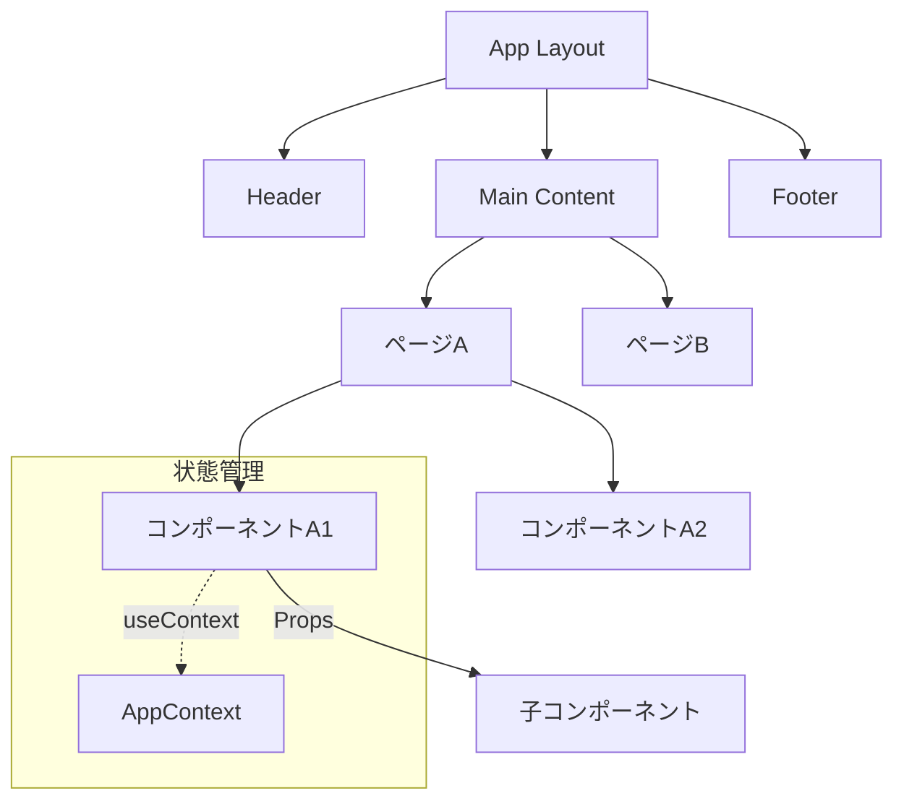
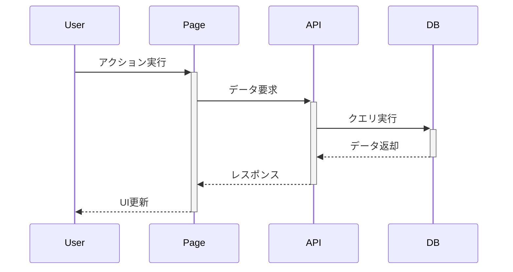
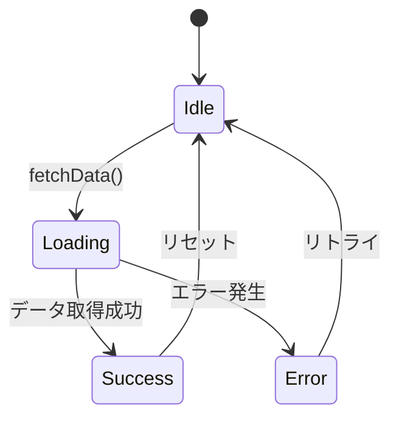

# Next.js + React + TypeScript プロジェクト修正ドキュメンテーション規約

## 1. 修正ドキュメント標準形式

すべての実装変更には、以下のドキュメント形式のうち適切なものを含めること。

### A. コンポーネント構造図 (Mermaid)
- 新規/変更コンポーネントとその親子関係を図示
- Props/State/Contextの依存関係を明示



### B. データフロー図 (Mermaid)
- ユーザーアクションから状態変更までのフロー
- API/データ取得プロセスの可視化



### C. 状態遷移図 (Mermaid)
- 複雑な状態管理を伴う変更の場合に必須
- 状態間の遷移条件を明記



### D. データモデル定義
- 新規/変更TypeScript型定義
- バックエンドとの整合性を確保

```typescript
// コンパクト型定義
type User = {
  id: string;        // ユーザーID
  name: string;      // 名前
  role: "admin" | "user"; // 権限
  settings?: UserSettings; // オプション設定
};

// 関連リレーション
// User 1:N Posts
// Post N:M Tags
```

### E. API変更仕様
- エンドポイント、パラメータ、レスポンス形式の変更点
- 認証要件やエラー処理の詳細

```
更新API: /api/resource/{id}
変更点: 
- 新規パラメータ追加: `includeDetails` (boolean)
- レスポンス拡張: `details` オブジェクト追加
- 認証要件: OAuth2 トークン必須
```

### F. コンポーネント修正サマリー
- Props/State変更点一覧
- UI変更の概要
- 影響範囲と依存コンポーネント

```
ComponentA:
- 新規Props: `enableFeatureX` (boolean)
- 新規State: `featureXState` (useState)
- 変更UI: 条件付きレンダリングでFeatureX表示
- 影響範囲: 親コンポーネントでのProps渡し変更必要
```

## 2. 修正規模別テンプレート

| 修正規模 | 必須ドキュメント | 推奨ドキュメント |
|---------|--------------|--------------|
| 小規模 (単一コンポーネント) | F | D |
| 中規模 (複数コンポーネント) | A, F | B, D |
| 大規模 (機能全体) | A, B, F | C, D, E |

## 3. ショートハンド指示フォーマット

```
#NRTP-<修正規模>
<修正内容の説明>
```

- `#NRTP-S`: 小規模修正 (Small)
- `#NRTP-M`: 中規模修正 (Medium)
- `#NRTP-L`: 大規模修正 (Large)

例: `#NRTP-M YouTubeビデオ埋め込み機能の追加`

この指示形式を使用すると、修正規模に応じた適切なドキュメント形式が自動的に適用されます。

NRTP = Next React TypeScript Project
