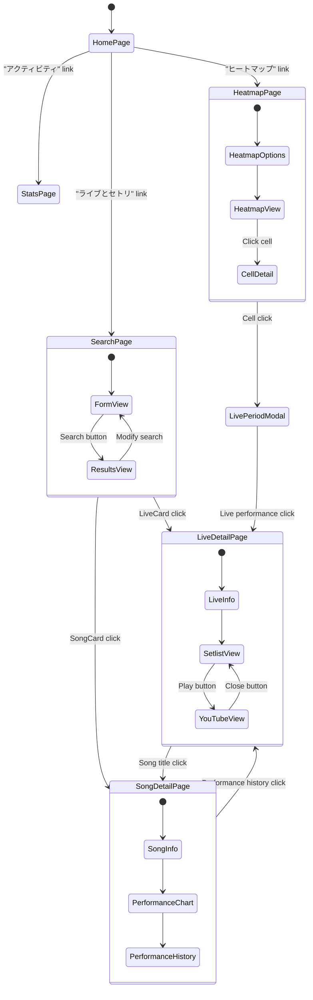

# Page Navigation Documentation

## Navigation Flow Diagram



## URL Structure

| Page | URL Pattern | Parameters |
|------|-------------|------------|
| Home | `/` | None |
| Search | `/search` | `?keyword=&venue=&yearStart=&yearEnd=&album=&playedMoreThan=&playedLessThan=&hasYoutubeVideos=` |
| Stats | `/stats` | None |
| Heatmap | `/heatmap` | None |
| Live Detail | `/lives/[liveId]` | `liveId`: Live performance ID |
| Song Detail | `/songs/[songId]` | `songId`: Song ID |

## Navigation Components

### Header Navigation

The main navigation is implemented in the Header component, providing links to:
- Home page
- Live & Setlist search
- Activity/Stats
- Heatmap

```tsx
<nav aria-label="メインナビゲーション">
  <ul className="flex flex-wrap space-x-2 items-center">
    <li>
      <Link 
        href="/search"
        className={`px-3 py-1 rounded-full text-sm transition-colors inline-flex items-center gap-1 ${
          isActive('/search') 
            ? 'bg-white/30 text-white' 
            : 'hover:bg-white/20 text-white'
        }`}
      >
        <span>ライブとセトリ</span>
      </Link>
    </li>
    <li>
      <Link 
        href="/stats" 
        className={`px-3 py-1 rounded-full text-sm transition-colors inline-block ${
          isActive('/stats') 
            ? 'bg-white/30 text-white' 
            : 'hover:bg-white/20 text-white'
        }`}
      >
        アクティビティ
      </Link>
    </li>
    <li>
      <Link 
        href="/heatmap" 
        className={`px-3 py-1 rounded-full text-sm transition-colors inline-block ${
          isActive('/heatmap') 
            ? 'bg-white/30 text-white' 
            : 'hover:bg-white/20 text-white'
        }`}
      >
        ヒートマップ
      </Link>
    </li>
  </ul>
</nav>
```

### Breadcrumbs Navigation

The Breadcrumbs component provides contextual navigation showing the current path or navigation history:

- Supports two modes: `history` and `location`
- `history`: Shows the navigation history like a trail
- `location`: Shows the hierarchical structure of the current URL
- State is persisted in localStorage

```tsx
<nav aria-label="パンくずリスト" className="px-4 py-2 bg-white rounded-lg shadow-sm mb-4">
  <ol className="flex flex-wrap items-center space-x-2 text-sm">
    {history.map((item, index) => (
      <BreadcrumbItem
        key={`${item.path}-${item.timestamp}`}
        item={item}
        isLast={index === history.length - 1}
        showDivider={index > 0 || breadcrumbsMode === 'history'}
      />
    ))}
  </ol>
</nav>
```

## Page Transitions

### Client-side Navigation

For most navigation, the application uses Next.js Link component for client-side transitions:

```tsx
<Link href={`/lives/${live.id}`}>
  {/* LiveCard content */}
</Link>
```

### Programmatic Navigation

For event-based navigation, the application uses the Next.js useRouter hook:

```tsx
import { useRouter } from 'next/navigation';

const router = useRouter();

// Navigate to live detail page
const handleLiveClick = (liveId) => {
  router.push(`/lives/${liveId}`);
};
```

## Navigation State Management

### View Mode Storage

The application stores the user's preferred view mode (list or timeline) in localStorage:

```tsx
// ビューモード切替時にlocalStorageを更新
const handleViewModeChange = (mode: 'list' | 'timeline') => {
  setCurrentViewMode(mode);
  try {
    if (typeof window !== 'undefined') {
      localStorage.setItem('liveViewMode', mode);
    }
  } catch (error) {
    console.error('LocalStorage error:', error);
  }
};
```

### Breadcrumbs History

Breadcrumb navigation history is stored in localStorage and managed by the useBreadcrumbs hook:

```tsx
export function loadBreadcrumbsHistory(): BreadcrumbItem[] {
  if (typeof window === 'undefined') return [];
  
  try {
    const savedHistory = localStorage.getItem('breadcrumbsHistory');
    return savedHistory ? JSON.parse(savedHistory) : [];
  } catch (error) {
    console.error('Error loading saved breadcrumbs:', error);
    return [];
  }
}

export function saveBreadcrumbsHistory(history: BreadcrumbItem[]): void {
  if (typeof window === 'undefined') return;
  
  try {
    localStorage.setItem('breadcrumbsHistory', JSON.stringify(history));
  } catch (error) {
    console.error('Error saving breadcrumbs to localStorage:', error);
  }
}
```

## Error Handling for Navigation

### Not Found Page

When navigating to a non-existent path, the application displays a custom 404 page:

```tsx
// src/app/not-found.tsx
export default function AppNotFound() {
  return (
    <div className="min-h-screen bg-gray-50">
      <main className="container mx-auto px-4 py-8">
        <div className="bg-white rounded-xl shadow-sm p-8 max-w-2xl mx-auto text-center">
          {/* Not found content */}
        </div>
      </main>
    </div>
  );
}
```

### Dynamic Route Error Handling

For dynamic routes like `/lives/[liveId]`, error handling is implemented with Next.js error components:

```tsx
// src/app/lives/[liveId]/error.tsx
'use client';

export default function LiveError({
  error,
  reset,
}: {
  error: Error & { digest?: string };
  reset: () => void;
}) {
  useEffect(() => {
    console.error('Live page error:', error);
  }, [error]);

  return (
    <div className="bg-white rounded-xl shadow-sm p-8 max-w-2xl mx-auto">
      {/* Error content with reset button */}
    </div>
  );
}
```