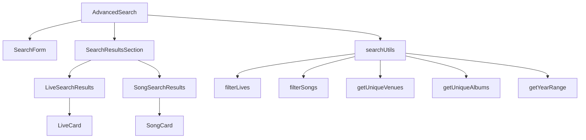
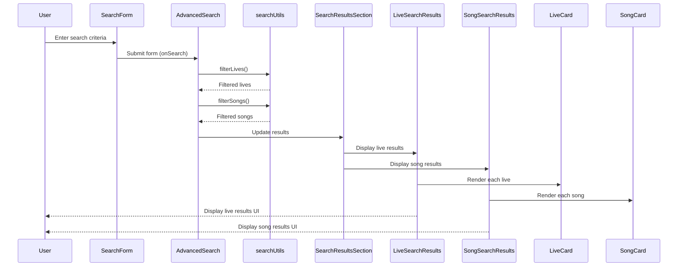

# Search Functionality Documentation

## Component Structure



## Data Flow



## Search Parameters

The search functionality uses a comprehensive set of parameters:

```typescript
export interface SearchParams {
  keyword: string;          // Keyword search (event name, venue, etc.)
  venue: string;            // Specific venue filter
  yearStart: string;        // Start year for date range
  yearEnd: string;          // End year for date range
  album: string;            // Filter by album
  playedMoreThan: string;   // Minimum play count
  playedLessThan: string;   // Maximum play count
  hasYoutubeVideos: boolean; // Filter for lives with YouTube videos
}
```

## Search Logic Implementation

### Lives Filtering

The `filterLives` function filters live performances based on search parameters:

```typescript
export function filterLives(
  lives: Live[],
  songs: Song[],
  setlists: SetlistItem[],
  searchParams: SearchParams
): (Live & { youtubeVideoCount: number })[] {
  // Calculate YouTube video counts
  const youtubeVideoCounts: Record<string, number> = {};
  setlists.forEach(item => {
    if (item.youtubeUrl && item.youtubeUrl.trim() !== '') {
      youtubeVideoCounts[item.liveId] = (youtubeVideoCounts[item.liveId] || 0) + 1;
    }
  });
  
  // Apply filters
  return lives
    .filter(live => {
      // Keyword filter
      if (searchParams.keyword) {
        const keyword = searchParams.keyword.toLowerCase();
        if (
          !live.eventName.toLowerCase().includes(keyword) &&
          !live.venueName.toLowerCase().includes(keyword) &&
          !live.memo?.toLowerCase().includes(keyword)
        ) {
          return false;
        }
      }
      
      // Venue filter
      if (searchParams.venue && live.venueName !== searchParams.venue) {
        return false;
      }
      
      // Year range filter
      const liveYear = new Date(live.date).getFullYear();
      if (searchParams.yearStart && liveYear < parseInt(searchParams.yearStart)) {
        return false;
      }
      if (searchParams.yearEnd && liveYear > parseInt(searchParams.yearEnd)) {
        return false;
      }
      
      // YouTube filter
      if (searchParams.hasYoutubeVideos) {
        const videoCount = youtubeVideoCounts[live.id] || 0;
        if (videoCount === 0) {
          return false;
        }
      }
      
      return true;
    })
    .map(live => ({
      ...live,
      youtubeVideoCount: youtubeVideoCounts[live.id] || 0
    }));
}
```

### Songs Filtering

The `filterSongs` function filters songs based on search parameters:

```typescript
export function filterSongs(
  songs: Song[],
  setlists: SetlistItem[],
  searchParams: SearchParams,
  filteredLiveIds: string[]
): (Song & { playCount: number })[] {
  // Count song performances in filtered lives
  const songPlayCounts: Record<string, number> = {};
  setlists.forEach(item => {
    if (filteredLiveIds.includes(item.liveId)) {
      songPlayCounts[item.songId] = (songPlayCounts[item.songId] || 0) + 1;
    }
  });
  
  // Filter and enhance songs with play count
  return songs
    .map(song => ({
      ...song,
      playCount: songPlayCounts[song.id] || 0
    }))
    .filter(song => {
      // Exclude songs that weren't played
      if (song.playCount === 0) return false;
      
      // Keyword filter
      if (searchParams.keyword) {
        const keyword = searchParams.keyword.toLowerCase();
        if (
          !song.title.toLowerCase().includes(keyword) &&
          !song.album.toLowerCase().includes(keyword)
        ) {
          return false;
        }
      }
      
      // Album filter
      if (searchParams.album && song.album !== searchParams.album) {
        return false;
      }
      
      // Play count filters
      if (searchParams.playedMoreThan && 
          song.playCount < parseInt(searchParams.playedMoreThan)) {
        return false;
      }
      if (searchParams.playedLessThan && 
          song.playCount > parseInt(searchParams.playedLessThan)) {
        return false;
      }
      
      return true;
    })
    .sort((a, b) => b.playCount - a.playCount);
}
```

## Form Implementation

The SearchForm component handles user input for search parameters:

```tsx
return (
  <form onSubmit={onSearch} className="space-y-6">
    <h2 className="text-xl font-bold text-gray-800 mb-4">詳細検索</h2>
    
    {/* Keyword search */}
    <div className="relative">
      <div className="absolute inset-y-0 left-0 pl-3 flex items-center pointer-events-none">
        <Search size={18} className="text-gray-400" />
      </div>
      <input
        type="text"
        placeholder="キーワードで検索（ライブ名、会場名など）"
        value={searchParams.keyword}
        onChange={(e) => onChangeSearchParam('keyword', e.target.value)}
        className="block w-full pl-10 pr-3 py-3 bg-gray-50 border border-gray-300 rounded-lg focus:ring-2 focus:ring-purple-500 focus:border-transparent outline-none"
      />
    </div>
    
    {/* Other filters... */}
    
    {/* Youtube Filter */}
    <div className="space-y-2">
      <label className="flex items-center gap-2 text-sm font-medium text-gray-700">
        <Youtube size={16} className="text-red-500" />
        YouTube動画
      </label>
      <div className="flex items-center">
        <input
          type="checkbox"
          checked={searchParams.hasYoutubeVideos}
          onChange={(e) => onChangeSearchParam('hasYoutubeVideos', e.target.checked ? 'true' : '')}
          className="w-4 h-4 text-purple-600 border-gray-300 rounded focus:ring-purple-500"
        />
        <label className="ml-2 text-sm text-gray-600">
          YouTubeの動画があるライブのみ表示
        </label>
      </div>
    </div>
    
    {/* Form buttons */}
    <div className="flex flex-wrap items-center justify-between pt-4 border-t border-gray-100">
      <div className="flex items-center gap-2">
        <Filter size={16} className="text-purple-500" />
        <span className="text-sm text-gray-600">
          {activeFiltersCount > 0 
            ? `${activeFiltersCount}個のフィルターが適用中` 
            : 'フィルターなし'}
        </span>
      </div>
      <div className="flex gap-3 mt-4 sm:mt-0">
        <button
          type="button"
          onClick={onClearFilters}
          className="px-5 py-2 border border-gray-300 rounded-lg text-gray-600 hover:bg-gray-50"
        >
          リセット
        </button>
        <button
          type="submit"
          className="px-5 py-2 bg-purple-600 text-white rounded-lg hover:bg-purple-700 focus:ring-2 focus:ring-purple-500 focus:ring-offset-2"
        >
          検索
        </button>
      </div>
    </div>
  </form>
);
```

## Search Results Implementation

### LiveSearchResults Component

Displays filtered live performances:

```tsx
return (
  <div>
    <div className="flex items-center justify-between mb-4">
      <h2 className="text-xl font-bold text-gray-800">
        ライブ検索結果
        <span className="ml-2 text-sm font-normal text-gray-500">
          {lives.length}件
        </span>
      </h2>
    </div>
    
    {lives.length > 0 ? (
      <div className="grid grid-cols-1 md:grid-cols-2 lg:grid-cols-3 gap-6">
        {lives.slice(0, displayCount).map((live) => (
          <LiveCard key={live.id} live={live} />
        ))}
      </div>
    ) : (
      <div className="bg-gray-50 rounded-lg p-6 text-center text-gray-500">
        条件に一致するライブが見つかりませんでした。
      </div>
    )}
    
    {/* Load more buttons */}
  </div>
);
```

### SongSearchResults Component

Displays filtered songs:

```tsx
return (
  <div>
    <div className="flex items-center justify-between mb-4">
      <h2 className="text-xl font-bold text-gray-800">
        楽曲検索結果
        <span className="ml-2 text-sm font-normal text-gray-500">
          {songs.length}件
        </span>
      </h2>
    </div>
    
    {songs.length > 0 ? (
      <div className="grid grid-cols-1 md:grid-cols-2 lg:grid-cols-3 gap-6">
        {songs.slice(0, displayCount).map((song) => (
          <SongCard
            key={song.id}
            song={song}
            stats={{ 
              playCount: song.playCount,
              // Additional stats could be added here
            }}
          />
        ))}
      </div>
    ) : (
      <div className="bg-gray-50 rounded-lg p-6 text-center text-gray-500">
        条件に一致する楽曲が見つかりませんでした。
      </div>
    )}
    
    {/* Load more buttons */}
  </div>
);
```

## Load More Functionality

The search results implement "load more" and "load all" functionality to handle large result sets:

```tsx
{lives.length > displayCount && (
  <div className="mt-4 text-center flex justify-center gap-3">
    <button 
      onClick={onLoadMore}
      className="px-4 py-2 text-sm text-purple-600 hover:text-purple-700 border border-purple-200 rounded-full hover:bg-purple-50"
    >
      さらに表示（+{lives.length - displayCount}件）
    </button>
    <button 
      onClick={onLoadAll}
      className="px-4 py-2 text-sm text-orange-600 hover:text-orange-700 border border-orange-200 rounded-full hover:bg-orange-50"
    >
      すべて表示（{lives.length}件）
    </button>
  </div>
)}
```

## Utility Functions

Several utility functions support the search functionality:

### getUniqueVenues

```typescript
export function getUniqueVenues(lives: Live[]): string[] {
  return Array.from(new Set(lives.map(live => live.venueName))).sort();
}
```

### getUniqueAlbums

```typescript
export function getUniqueAlbums(songs: Song[]): string[] {
  return Array.from(new Set(songs.map(song => song.album).filter(Boolean))).sort();
}
```

### getYearRange

```typescript
export function getYearRange(lives: Live[]): { min: number; max: number } {
  if (lives.length === 0) {
    return { min: 2000, max: new Date().getFullYear() };
  }
  const years = lives.map(live => new Date(live.date).getFullYear());
  return {
    min: Math.min(...years),
    max: Math.max(...years),
  };
}
```

## Performance Considerations

1. Memoization of expensive operations using `useMemo`
2. Pagination of results using the display count state
3. Filtering performed client-side for static site generation compatibility
4. Efficient re-rendering patterns using React state management
